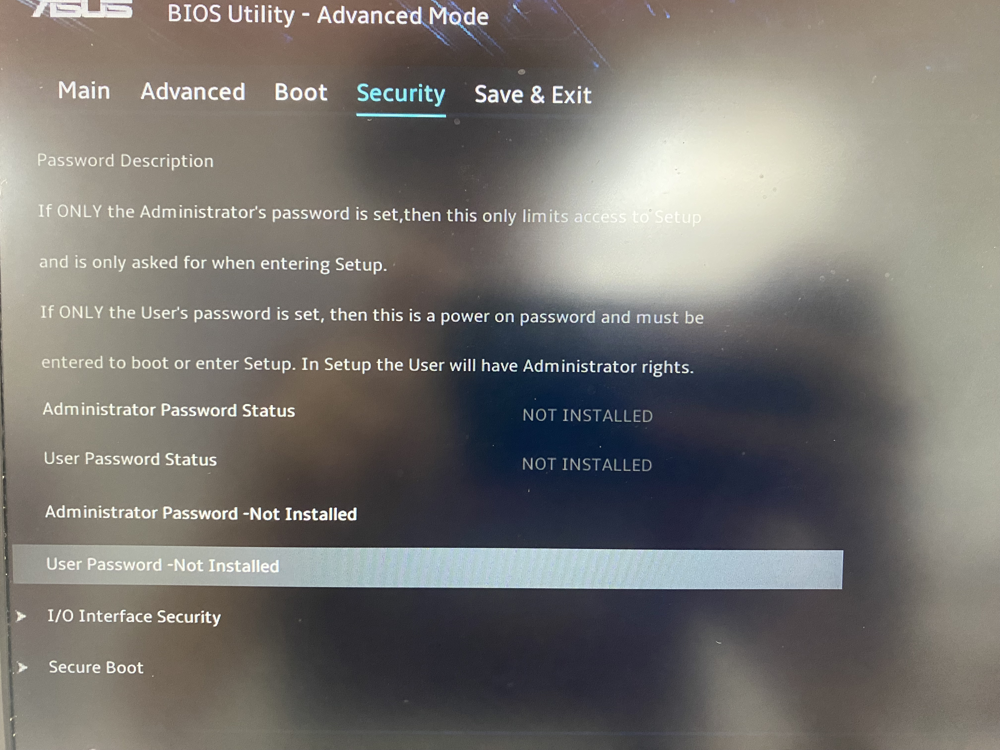
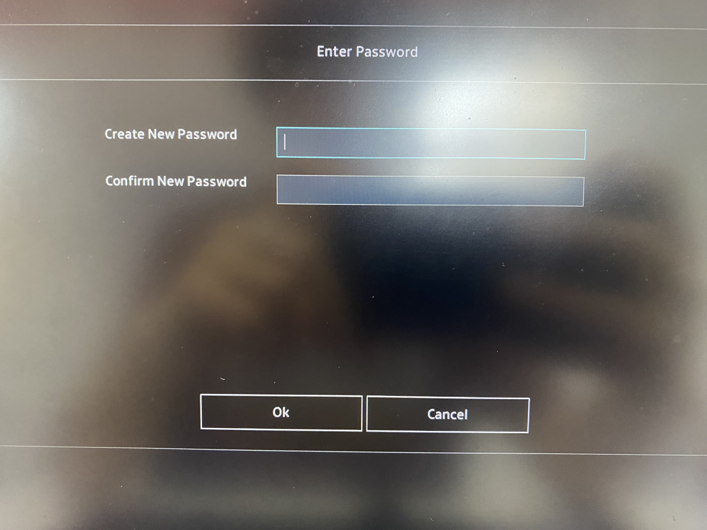
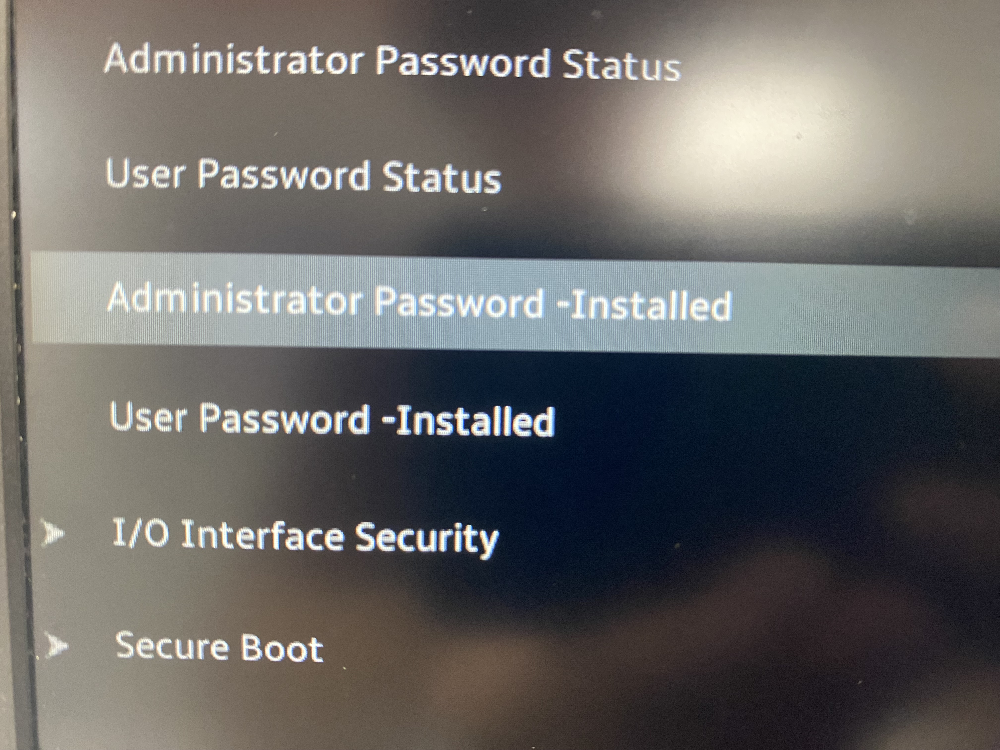
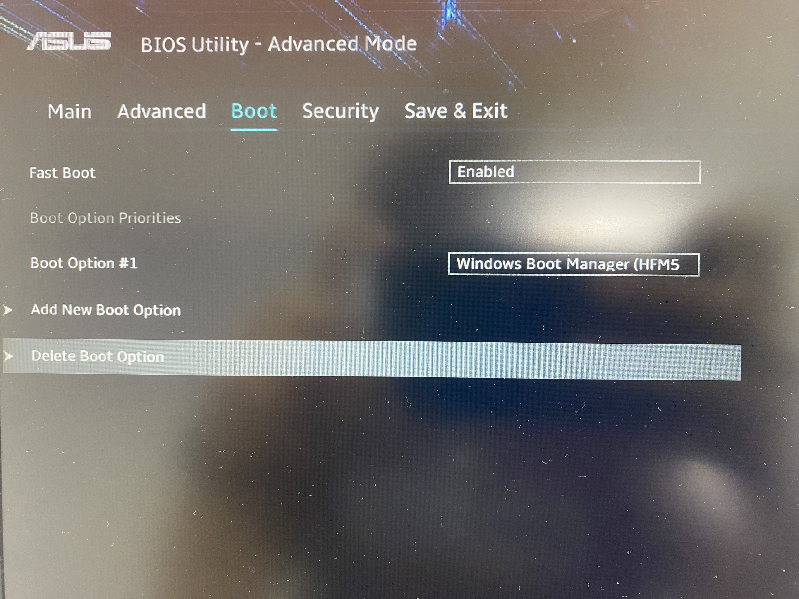
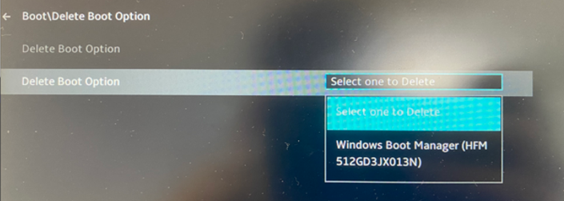
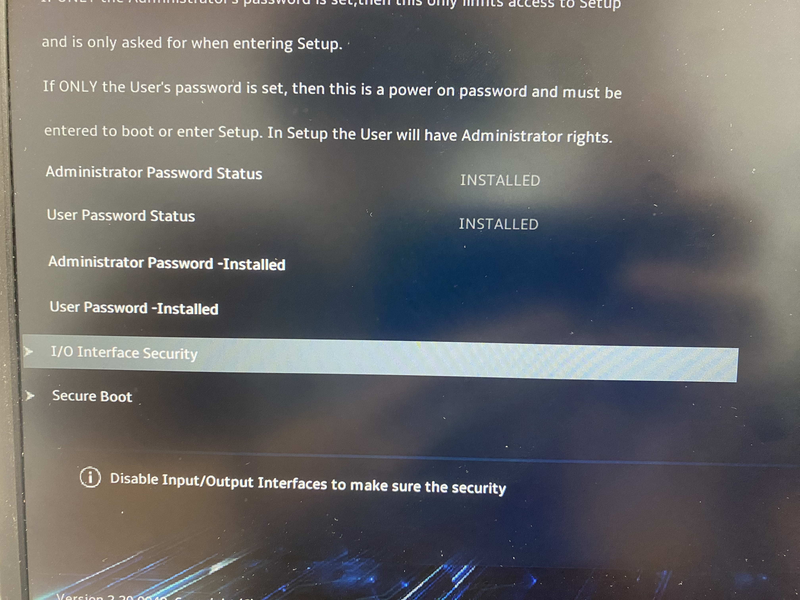
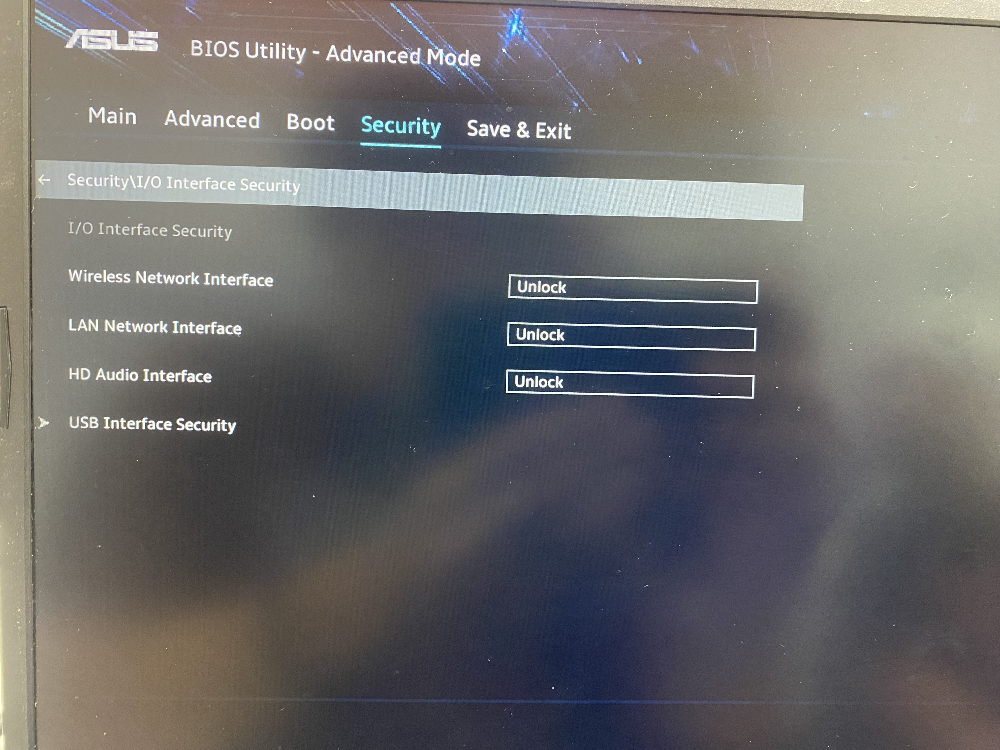
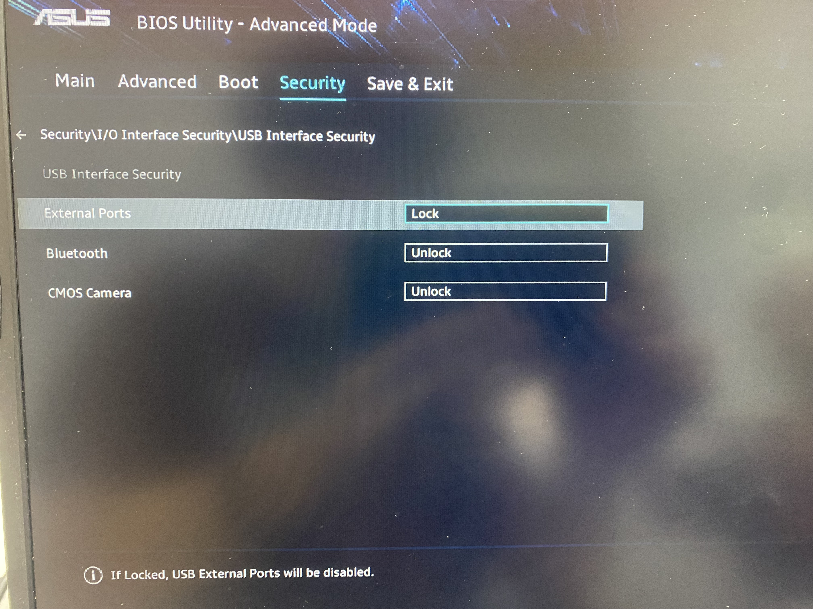
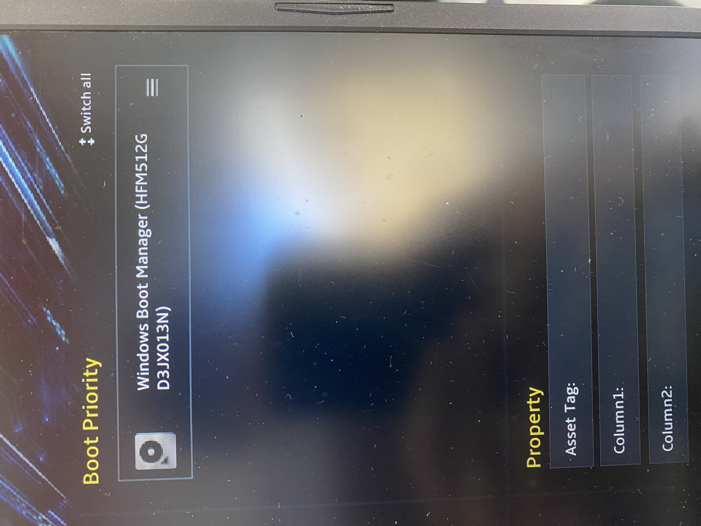
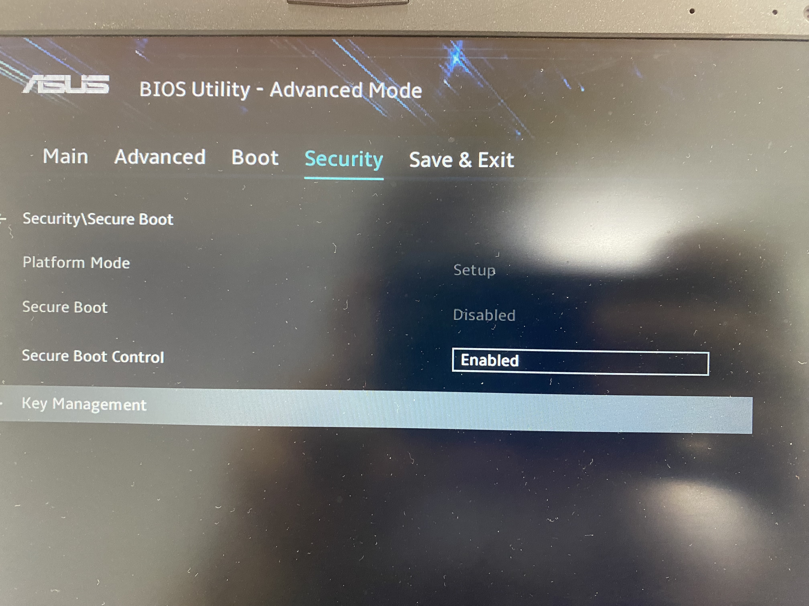

author: David Vila Díaz
summary: PROYECTO BASTIONADO
id: BIOS-UEFI
categories: codelab,markdown
environments: Web
status: Published
feedback link: 
analytics account: ID
# PROYECTO BASTIONADO BIOS/UEFI

## Introducción 

A día de hoy, donde cada proceso computacional y transacción dependen en gran medida del funcionamiento óptimo y seguro de los sistemas informáticos, es importante abordar cada componente desde una perspectiva de seguridad. Uno de estos componentes críticos que a menudo se pasa por alto, pero que actúa como la primera línea de defensa y el núcleo del proceso de arranque de un ordenador, es el sistema básico de entrada/salida, también llamado BIOS, o en sistemas más modernos, la interfaz de firmware extensible unificada UEFI.

BIOS/UEFI es el software integrado en una placa madre que se ejecuta al encender una computadora. No sólo inicia el sistema operativo y el hardware del sistema, sino que también ofrece varias opciones y configuraciones que pueden influir significativamente en la seguridad del sistema. Un BIOS/UEFI comprometido puede resultar en una amplia gama de problemas de seguridad, desde la exposición de datos confidenciales hasta el control total del sistema por parte de actores maliciosos.

He realizado una serie de configuraciones de seguridad en este como guía para computadoras con placa base de ASUS, es decir, con la ASUS BIOS Utility, y he aquí los resultados:

### **Configuremos una contraseña de arranque:** 

Una vez entramos a la BIOS (el cual en este caso se accede dejando pulsado el botón F2 al iniciar el PC), accedemos a la pestaña de “Security”, en la cual encontraremos una serie de parámetros como “User Password”, que como nos indica aparece como “No instalada”.
    

 Si clicamos nos aparecerá esta ventana:

Ingresamos la contraseña de arranque deseada, le damos a “Ok” y ya estaría más que establecida.

##  **PRIMEROS PASOS**

### **Configuremos una contraseña de administrador:**
    
    En la misma sección donde está la opción de “User Password”, justo arriba se encuentra “Administrator Password”, que como indica “no está instalada”.
    

Clicamos en ella y nos saldrá la misma ventana de inserción de credenciales que en el anterior punto.

Una vez clicamos en “Ok” se guardará, y veremos las dos opciones con un título de “Instalado”:

### **Se quiere evitar arranques de dispositivos externos (USB…)**
    
Antes de empezar, he de comentar que la ASUS BIOS Utility es menos compleja que otras BIOS, es decir que hay menos opciones, pero no quita que se puedan dar variedad de configuraciones de seguridad.
    
En este caso, accedemos a la pestaña de Boot (Inicio), justo al lado de Security, una vez en ella, encontraremos una opción llamada “Delete Boot Option” la cual nos servirá para eliminar el dispositivo USB que este conectado en caso de querer eliminarlo de manera manual.
    

Si queremos desactivar todo tipo de arranque por USB, deberemos volver a la pestaña de “Security” del principio, en la cual encontraremos una opción llamada “I/O Interface Security”:

Accedemos a ella y encontraremos una opción llamada USB Interface Security, a la cual también accederemos:

Es aquí cuando desplegamos la opción de “External ports”, para después elegir la opción “Lock”, el cual tendrá el efecto de bloquear el uso de Arranques Externos a través de USB.

## **MÁS PASOS**

### **Se quiere establecer un orden de arranque seguro:** 
    
En esta sección, simplemente vamos al menú principal, justo cuando se inicia la BIOS; he aquí la parte en la cual se nos mostrará la prioridad de arranque de cada dispositivo, dispuesto en forma de columna de arriba hacia abajo, en la cual se pueden mover los dispositivos de esta manera para darle más prioridad o menos:
    

    
Este paso de seguridad es tan simple como esto, y no conlleva buscar más a fondo otras opciones.
    
### **Modo Seguro** 
    
Como última opción, se puede establecer el inicio seguro, que como ya sabemos está creado para que el sistema operativo inicie sin ninguna aplicación de terceros.
    
Esta es una de las otras opciones que se pueden llegar a utilizar en caso de querer prevenir o directamente solucionar un problema vírico o de tipo malware en el sistema, y es bastante útil ya que en la gran mayoría de casos va a servir para solucionar todos los problemas desde cero.
    
Para ello accedemos a la pestaña de “Security”, y en ella vamos a la opción de “Secure Boot”, que nos llevará a otra pestaña para activar una opción llamada “Security Boot Control” a través de un desplegable, en el cual debemos dejar puesto “Enabled”:
    
