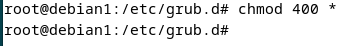

author: David Vila Díaz
summary: PROYECTO BASTIONADO
id: GRUB
categories: codelab,markdown
environments: Web
status: Published
feedback link: 
analytics account: ID
# PROYECTO BASTIONADO GRUB

## Introducción

Uno de los gestores de arranque más utilizados en sistemas Linux a día de hoy es GRUB (GRand Unified Bootloader). Aunque GRUB es extremadamente versátil en su forma estándar, existe un gran potencial para adaptarlo y mejorarlo según las necesidades específicas de un usuario o una organización.

Esta es una guía basada en crear capas de seguridad en este gestor de arranque, para que ningún actor malicioso pueda hacer uso de ellas ante nuestra ética. Es por ello que se tratarán lo siguientes puntos de seguridad: se quiere ocultar el menú de arranque, se quiere crear una contraseña de seguridad para el acceso a este, se va a explicar como crear copias de seguridad de la información de arranque del GRUB, y por último una opción de seguridad añadida.

Antes de empezar, hay que comentar que el sistema en el cual se realizarán esta serie de configuraciones será en Debian 12.2.0.

##  **PRIMEROS PASOS**

### **Ocultación de menú de aranque:**

Una vez iniciado Debian, queremos acceder a un archivo de configuración de GRUB, para ello abrimos la terminal (Ctrl+Alt+T) y en este sistema se nos pide usuario root para realizar todas las acciones que se mostrarán en esta guía; para ello: “su -”.
    
Una vez con usuario root, vamos a hacer un “nano /etc/default/grub” para poder editar este archivo. Vamos a cambiar el parámetro “GRUB_TIMEOUT” para que sea igual a 0, y añadimos una línea llamada “GRUB_TIMEOUT_STYLE=hidden” para que el menú permanezca oculto.
    

    
Guardamos archivo y pasamos a la siguiente acción de seguridad.
    
## **Configuremos una contraseña de arranque:**
    
Primeramente, para ello escribimos este comando en la terminal: “grub-mkpasswd-pbkdf2”, una vez hecho te preguntará que insertes una contraseña, que es la que va a ser cifrada para posteriormente utilizarla para el GRUB. 
    

    
Esto no significa que cada vez que queramos entrar al sistema debamos insertar todo ese trozo de código, sino que si alguien quiere acceder a algún archivo del sistema para mirar la contraseña de este, se encontrará con un nivel de seguridad de tipo cifrado al cual no tendrá acceso y solo sabrá el usuario que lo creó, es decir, solo tienes que insertar la contraseña que pusiste antes de haber sido cifrado.
    
Una vez hecho esto, vamos a editar el archivo “40_custom” con el comando “nano /etc/grub.d/40_custom”, en el cual añadiremos las siguientes líneas:
    
set superusers=”tu_nombre_de_usuario”
    
password_pbkdf2    tu_numbre_de_usuario     contraseña_cifrada
    

    
De esta manera cada vez que se inicie el dispositivo y pase el GRUB, nos pida la contraseña.
    
Guardamos y salimos del archivo.
    
ATENCIÓN: Para que todos los cambios hechos anteriormente (Y LOS POSTERIORES) funcionen, se debe usar un comando llamada “update-grub”, el cual actualizará los archivos para que el GRUB los lea.
    

    
## **MÁS PASOS**

### **Copias de seguridad de GRUB**

En este apartado, vamos a crear copias de seguridad almacenadas a través de la línea de comandos y sin programa alguno, comprimiendo los archivos “.cfg” o de configuración de GRUB.

Para ello utilizaremos este comando (el cual he editado a mi manera para darle el nombre que yo quiero):

sudo tar zcvf grub2copia_-$(date +%d-%m-%Y).tar /etc/default/grub /etc/grub.d/ /boot/grub/grub.cfg

Los parámetros que he elegido harán que se menciona el día, la hora y el año en la cual se comprimió la información. Simplemente al hacer este comando ya tenemos guardado el archivo en nuestra carpeta raíz.

### **Permisos de edición y lectura de archivos de configuración.**

Como último paso, he establecido un nivel de seguridad a través de permisos a mis archivos de configuración; para ello nos vamos a la carpeta de “/etc/grub.d/”, y aquí escribiremos este comando:

chmod 400 *

¿Qué se consigue con este comando? Que ningún usuario con permisos de administrador pueda ni leer ni realizar cambios en los archivos de esta carpeta, además, están ocultos.